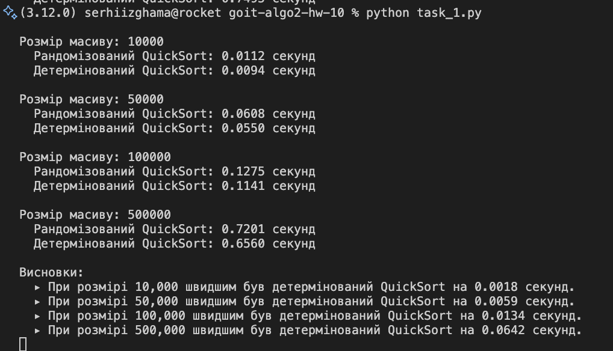
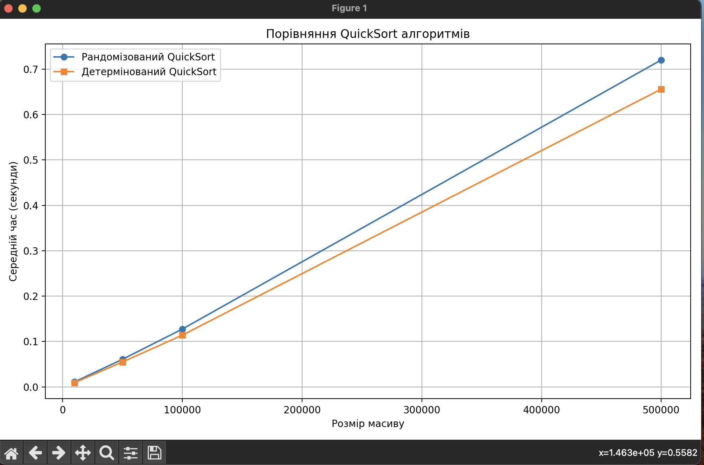
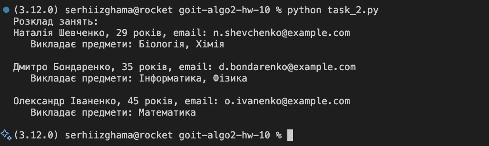

# goit-algo2-hw-10

## TASK 1

Висновок: Обидва алгоритми мають схожу продуктивність на випадкових масивах, проте рандомізований QuickSort демонструє стабільно трохи кращі результати на великих розмірах масивів. Це пов’язано з меншою ймовірністю вибору невдалого pivot-елемента, що може зменшити глибину рекурсії.

## TASK 2

